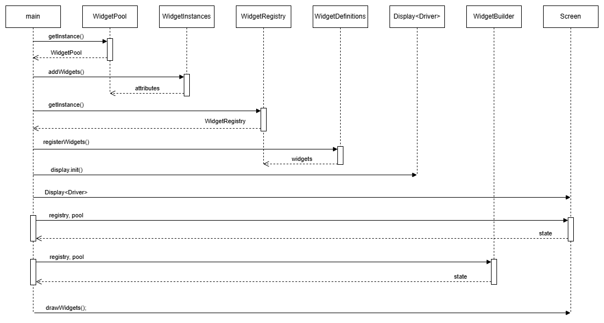
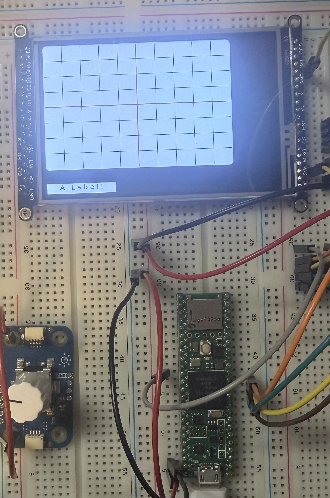

# ComposeUI "IS"

ComposeUI is a declarative framework built on top of <span style="color:blue">**[LVGL](https://lvgl.io/)**</span>, designed for embedded systems. It attempts to simplify UI development by providing a structured, registry-driven pipeline for defining, configuring, and rendering widgets. With ComposeUI, you can focus on high-level widget design without directly managing LVGL's low-level API calls. The framework handles:

- **Defining widget attributes:** Centralized in a registry.
- **Creating widget instances:** Managed in a pool.
- **Orchestrating rendering:** Automates LVGL object creation, attribute application, and rendering.

# ComposeUI "IS NOT"

ComposeUI is focused on structured UI construction. It does **not** provide:

- **Visual GUI designer:** No drag-and-drop editor; widgets are defined in code.
- **LVGL replacement:** ComposeUI wraps LVGL; you still need LVGL installed.
- **Dynamic runtime UI:** Widgets are statically defined at compile time.
- **Theme/styling engine:** Styling is per-widget via attributes, not global themes.
- **Layout engine:** Uses LVGL's built-in alignment; no custom layout algorithms.
- **Full application framework:** Focused solely on UI construction, not app logic.
- **Input handling framework:** LVGL handles input; ComposeUI doesn't add abstraction.

# Core Design Principles

ComposeUI is designed with modularity, scalability, and maintainability in mind:

- **Registry-Driven:** Widget configurations are stored as `Attribute` structs, decoupled from LVGL objects.
- **Separation of Concerns:** `Instances (WidgetPool)` are distinct from `Definitions (WidgetRegistry)`, separating data and behavior.
- **Driver Abstraction:** Display hardware is abstracted via templated driver structs, making it easy to adapt to different hardware.
- **State Machine Orchestration:** Both Screen and Builder components use state machines for predictable and manageable lifecycle transitions.
- **Static Polymorphism:** Templates enable compile-time driver binding.

---

## System Design Diagrams

<details>
<summary>File Structure</summary>

```
src/
├── main.cpp                          # Orchestrator: setup() and loop()
├── display/
│   ├── Display.h                     # Template wrapper for hardware drivers
│   └── FlushCallback.h               # LVGL ↔ Driver bridge
├── ui/
│   ├── lvgl/
│   │   └── Screen.h                  # LVGL coordinator
│   ├── pool/
│   │   └── WidgetPool.h/.cpp         # Singleton: widget instance storage
│   ├── registry/
│   │   └── WidgetRegistry.h/.cpp     # Singleton: widget attribute storage
│   ├── definitions/
│   │   └── WidgetDefinitions.h/.cpp  # User-defined widget attribute configs
│   ├── instances/
│   │   └── WidgetInstances.h/.cpp    # User-defined widget instances
│   ├── builder/
│   │   └── WidgetBuilder.h/.cpp      # Custom widget configurator
│   └── widgets/
│       └── Widget.h/.cpp             # Base class (LVGL pointer + callback)
|
├── render/
│   └── GraticulesRenderer.cpp        # Custom widget draw callback
└── utils/
    ├── WidgetAttributes.h            # Widget attribute schema
    ├── Math.h                        # Color conversions and geometry scaling
    ├── LVGL.h                        # LVGL specific debuging and widget creation helper
    ├── HashTable.h                   # Fixed-capacity hash table with forward iterator
    └── Constants.h                   # System-wide limits
```

</details>

<details>
<summary>Sequence Diagram</summary>



</details>

---

## Basic Use of the System

The following instructions are designed to help you quickly get started with ComposeUI. They assume you are working with the existing types implemented in the system: the `Graticules` custom object and the `Text Label`. These examples are intended for experimentation and to give you a feel for how the system works. If you plan to use custom widget types or types not already defined in `WidgetAttributes::Type`, you will need to extend the system by adding new definitions, instances, and rendering logic.

<details>
<summary>Create widget instances</summary>

`ui/instances/WidgetInstances`:

```cpp
      namespace UI::Instances::Widgets {

        Custom custom;
        Widget builtIn;

        void setDrawEvent() {
          custom.setCallBack(custom_draw_event_cb);
        }

        void addWidgets(WidgetPool& pool) {
          setDrawEvent();
          pool.addWidget(Utils::Widget::Type::<custom>, &custom);
          pool.addWidget(Utils::Widget::Type::<built-in>, &builtIn);
        }
      }
```

</details>

<details>
<summary>Configure widget attributes</summary>

`ui/definitions/WidgetDefinitions`:

```cpp
      namespace UI::Definitions::Widgets {

        Utils::Widget::Attributes custom;
        Utils::Widget::Attributes builtIn;

        void setCustom() {

          custom.isCustom = true;
          custom.type = Utils::Widget::Type::CUSTOM;
          custom.name = "Custom";

          custom.geometry.mode = Utils::Widget::SizingMode::AREA_PERCENT;
          custom.geometry.percentSize = 70;

          custom.data.<some_union_type>.<attribute> = 0;
        }

        void setBuiltIn() {
          ...
        }

        void registerWidgets(WidgetRegistry& registry) {
          setCustom();
          setBuiltIn();
          registry.registerWidget(Utils::Widget::Type::<custom>, &custom);
          registry.registerWidget(Utils::Widget::Type::<built-in>, &builtIn);
        }
      }
```

</details>

---

## Extending the System

<details>
<summary>Adding a Custom Widget</summary>

1. **Create the widget class** in `ui/widgets/`
2. **Create a renderer** in `render/`
3. **Add to the Type enum** in `utils/WidgetAttributes`:

```cpp
    enum class Type {
      DEFAULT,
      LABEL,
      GRAPH,
      MY_WIDGET  // Add here
    };
```

4. **Add type-specific data** to the union in `utils/WidgetAttributes`:

```cpp
      union Data {
        Graph graph;
        MyWidgetData myWidget;  // Add here
        Data() {}
      } data;
```

5. **Register instance** in `ui/instances/WidgetInstances`
6. **Define attributes** in `ui/definitions/WidgetDefinitions`
7. **Add Builder case** in `ui/builder/WidgetBuilder`:

```cpp
      case Utils::Widget::Type::MY_WIDGET: {
        MyWidget* w = static_cast<MyWidget*>(widgetPointer);
        w->configure(widgetAttributes->data.myWidget);
        break;
      }
```

</details>

<details>
<summary>Adding a Built-In LVGL Type</summary>

1. **Add to Type enum** in `WidgetAttributes`
2. **Add attribute struct** (e.g., `Button`, `Checkbox`)
3. **Update `Utils::LVGL::createWidget()`** in `LVGL.h`:

```cpp
      case Utils::Widget::Type::BUTTON:
        return lv_btn_create(parent);
```

5. **Add configuration section** in `Screen.h` `setWidgets()`:

```cpp
      if (attributes->button./* ... */) {
        lv_btn_set_/* ... */
}
```

5. **Register instance** in `ui/instances/WidgetInstances`
6. **Define attributes** in `ui/definitions/WidgetDefinitions`

### Adding a Display Driver

1. **Create a driver struct** in `src/display/`:

2. **Update the `main.cpp` file**:

```cpp
      static Display<YourDriverStruct> display(LCD_CS, LCD_DC, LCD_RST);
      static Screen<YourDriverStruct> screen(display);
```

3. **Use `display.debugDraw()` to validate hardware initialization.**
4. **Use `screen.debugDraw()` to validate LVGL rendering.**

</details>

---

## Dependencies

- **LVGL** (v9.x) - Graphics library
- **Adafruit_HX8357** - Display driver library (for TFT_HX8357D)
- **Arduino** - Platform IO or suitable framework

### Hardware

ComposeUI is designed to run on the Teensy 4.1 or any compatible Arduino board. Since it is built using standard C++ and Arduino libraries, it can be adapted to a wide range of hardware platforms that support these environments.

---

## System Demonstration

<details>
<summary>Display</summary>



</details>

📄 [Serial Debug Output](./assets/serial_output.txt)

---

## About This Project

ComposeUI was created as a portfolio project to demonstrate my skills in C++ and embedded systems development. While I do not plan to actively maintain this project, I may occasionally update it to refine the system or move it closer to being a functional interface for an oscilloscope I hope to one day complete.

This project was designed to address the pain points I encountered while working with LVGL, and I believe it offers a novel approach to simplifying UI development for embedded systems. I hope others find it useful and inspiring for their own projects.

📄 [License](LICENSE.txt)
